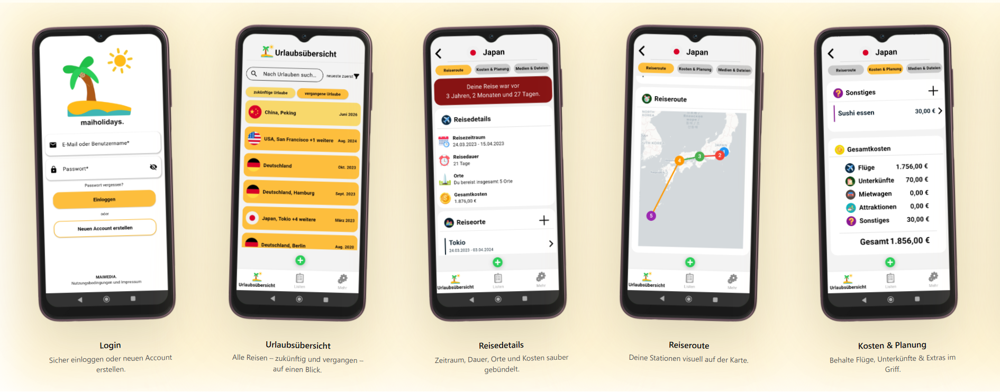

# maiholidays

**Deine smarte Reiseplanung für unterwegs**

maiholidays ist eine mit Flutter entwickelte App, mit der Reisen übersichtlich geplant und organisiert werden können.

> Dieses Repository dient ausschließlich zur Vorstellung der App.
> Der Quellcode von maiholidays ist nicht öffentlich zugänglich.

---

## App herunterladen

maiholidays ist für Android im Google Play Store verfügbar:

[maiholidays im Google Play Store öffnen](https://play.google.com/store/apps/details?id=com.moritzmaienschein.maiholidays)

---

## Einblick in die App

  

---

## Über maiholidays

Mit maiholidays behältst Du jederzeit den Überblick über Deine Reisen. Die App unterstützt Dich bei der Planung von Urlauben, Wochenendtrips und Geschäftsreisen und führt alle wichtigen Reiseinformationen an einem Ort zusammen.

Die Benutzeroberfläche wurde mit dem Ziel entwickelt, eine einfache, intuitive und übersichtliche Reiseplanung zu ermöglichen. Persönliche Reiseinhalte sind privat und ausschließlich für den jeweiligen Nutzer sichtbar.

---

## Funktionen

### Reiseplanung

Erstelle und verwalte Deine Reisen zentral in einer App. So hast Du alle wichtigen Informationen für bevorstehende und vergangene Trips jederzeit griffbereit.

### Kostenübersicht

Erfasse Deine Reiseausgaben und behalte Dein verfügbares Budget im Blick. Dadurch kannst Du die Kosten einer Reise übersichtlich planen und nachvollziehen.

### KI-Funktion

Erspare dir manuelles erfassen von Daten und teile stattdessen der KI mit, was du eintragen möchtest. Die KI wird anhand deiner Beschreibungen sämtliche Planungen und Kosten für dich hinterlegen.

### Pack- und To-Do-Listen

Erstelle individuelle Packlisten für Deine Reisen und hake bereits eingepackte Gegenstände direkt in der App ab. Organisiere Aufgaben, die vor oder während einer Reise erledigt werden müssen. So gerät nichts Wichtiges in Vergessenheit.

### Reisefotos

Lade eigene Fotos hoch und halte besondere Erinnerungen Deiner Reisen direkt in der App fest.

---

## Technischer Hintergrund

maiholidays wurde als eigenständiges Softwareprojekt konzipiert, gestaltet und entwickelt.

Für die Umsetzung wurden unter anderem folgende Technologien eingesetzt:

* **Flutter und Dart** für die App-Entwicklung
* **Supabase** als Backend-as-a-Service
* **PostgreSQL** zur Speicherung strukturierter Daten
* **Adobe XD und Figma** für die Konzeption des UI/UX-Designs
* **Google Play Console** für die Veröffentlichung und Verwaltung der Android-App

---

## Projektstatus

maiholidays wird kontinuierlich weiterentwickelt. Neue Funktionen sowie Verbesserungen an der Benutzeroberfläche und der technischen Umsetzung werden schrittweise ergänzt.

---

## Kontakt

Entwickelt von **Moritz Maienschein**

Bei Fragen zur App oder zum Projekt kannst Du mich über mein GitHub-Profil kontaktieren.

---

## Hinweis

Google Play und das Google-Play-Logo sind Marken von Google LLC.
